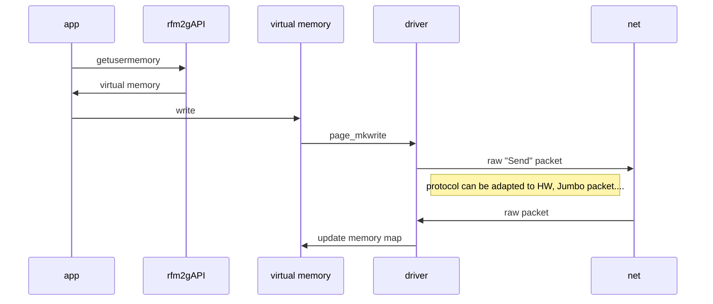

# VRFM kernel module

this kernel module provides a char device in linux compatible with RFM2g Reflective Memory form GE





# Performances
ping:
```ping round: 0.161191 ms
ping round: 0.134627 ms
ping round: 0.114257 ms
ping round: 0.119945 ms
ping round: 0.096536 ms
ping round: 0.129444 ms
ping round: 0.133351 ms
ping round: 0.126472 ms
ping round: 0.123368 ms
ping round: 0.107660 ms
ping round: 0.146254 ms
ping round: 0.095956 ms
ping round: 0.179879 ms
ping round: 0.304058 ms
ping round: 0.235802 ms
ping round: 0.134236 ms
ping round: 0.130524 ms
```
