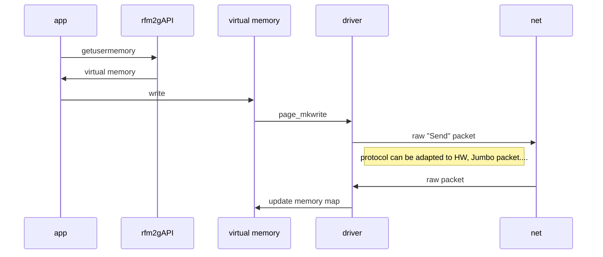

# VRFM kernel module

this kernel module provides a char device in linux compatible with RFM2g Reflective Memory form GE





# Performances
ping:
```
ping round: 0.161191 ms
ping round: 0.134627 ms
ping round: 0.114257 ms
ping round: 0.119945 ms
ping round: 0.096536 ms
ping round: 0.129444 ms
ping round: 0.133351 ms
ping round: 0.126472 ms
ping round: 0.123368 ms
ping round: 0.107660 ms
ping round: 0.146254 ms
ping round: 0.095956 ms
ping round: 0.179879 ms
ping round: 0.304058 ms
ping round: 0.235802 ms
ping round: 0.134236 ms
ping round: 0.130524 ms
```


performancetest on dummy card
```

  PCI RFM2g Commandline Diagnostic Utility

  Available devices:

    0.  /dev/rfm2g0  (UNKNOWN, Node 1)
UTIL0 > performancetest

RFM2g Performance Test (DMA Threshold is 0)
---------------------------------------------------
   Bytes     Read IOps   Read MBps     Write IOps     Write MBps
       4       7782502        29.7        3397072           13.0
       8       7804046        59.5        3410481           26.0
      12       7806636        89.3        3377798           38.7
      16       7796971       119.0        3256292           49.7
      20       7807526       148.9        3184557           60.7
      24       7797026       178.5        3084442           70.6
      28       7793963       208.1        2996863           80.0
      32       7788465       237.7        2956814           90.2
      64       7813926       476.9        2448738          149.5
      96       7691321       704.2        2112699          193.4
     128       7687288       938.4        1856509          226.6
     256       7491411      -219.0        1245560          304.1
     384       7429630       672.8         938339          343.6
     512       7342587      -510.8         753613          368.0
     640       7255523       332.4         625641          381.9
     768       7190252      -877.7         536135          392.7
     896       7095353       -81.1         463455          396.0
    1024       7004129       696.0         410324          400.7
    1152       6940189      -567.3         375075          412.1
    1280       6853799       174.5         338623          413.4
    1408       6804757       945.2         306448          411.5
    1536       6747321      -356.2         279346          409.2
    1664       6459901        11.3         251301          398.8
    1792       6396546       691.6         242408          414.3
    1920       6523703      -342.7         227838          417.2
    2048       6442196       294.4         213152          416.3
    2560       6214210       835.4         172473          421.1
```

performancetest on 100 Bbit card
```
  PCI RFM2g Commandline Diagnostic Utility

  Available devices:

    0.  /dev/rfm2g0  (UNKNOWN, Node 1)
Please enter device number: UTIL0 > performancetest

RFM2g Performance Test (DMA Threshold is 0)
---------------------------------------------------
   Bytes     Read IOps   Read MBps     Write IOps     Write MBps
       4       8681761        33.1         149032            0.6
       8       7206712        55.0         149022            1.1
      12       7049561        80.7         149015            1.7
      16       7144440       109.0         149011            2.3
      20       7200364       137.3         149040            2.8
      24       6835978       156.5         149039            3.4
      28       7137356       190.6         148992            4.0
      32       7151529       218.2         149008            4.5
      64       7141019       435.9         108046            6.6
      96       6995389       640.4          84750            7.8
     128       6851117       836.3          69804            8.5
     256       6927615      -356.7          40987           10.0
     384       6981339       508.6          29101           10.7
     512       6876578      -738.3          22610           11.0
     640       6867662        95.7          18516           11.3
     768       6383109       579.1          15706           11.5
     896       6519118      -573.5          13653           11.7
    1024       6521711       224.9          12088           11.8
    1152       6579608      -963.4          10852           11.9
    1280       6543041      -204.9           9864           12.0
    1408       6389572       387.7           9039           12.1
    1536       6382588      -890.5           7855           11.5
    1664       6322002      -207.5           7306           11.6
    1792       6297424       522.2           6826           11.7
```
